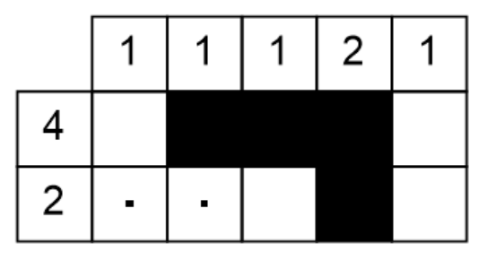

# Japanese crosswords / nonocode / logigramme / whatever

This game is a puzzle game where you have to draw a picture from a set of constraints. You can read the full explanations of the rules on wikipedia (https://en.wikipedia.org/wiki/Nonogram).

The goal of this coding session is to write a function that, given the state of the puzzle, will give you a new state with more resolved constraints.

This link gives several resolution techniques, feel free to pick one, or use the one I'll suggest in a minute.

